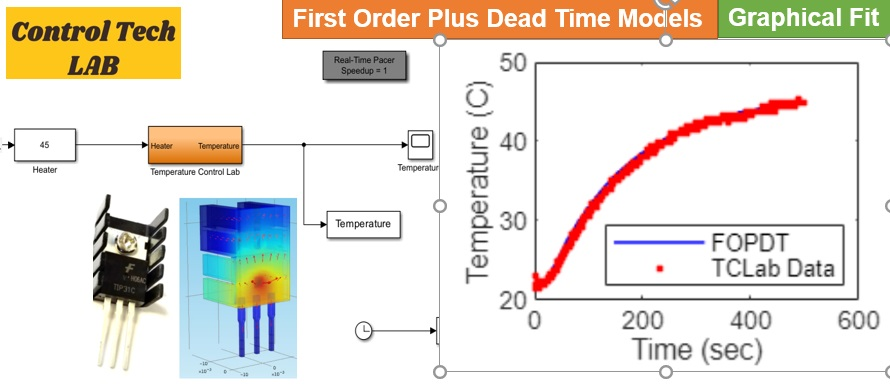

# Intelligent Control Systems by Asst. Prof. Dr. Claudia F. Yaşar

This repository contains the curriculum materials used for the Intelligent Control Systems course YTU Department of Control and Automation Engineering.

# First-Order-Plus-Dead-Time-Models
An interactive Live Script allows users to adjust parameters and fit the main dynamic parameters to temperature data for hands-on learning

# Acknowledgements
I would like to express my gratitude to the students of the Intelligent Control Systems course of the YTÜ Control and Automation Engineering department, Class 2022 and 2023, whose dedication and hard work made this project possible. I am also deeply thankful to our Control Tech LAB team, Doctors Marco Rossi, and Melda Ulusoy for their invaluable contributions.

